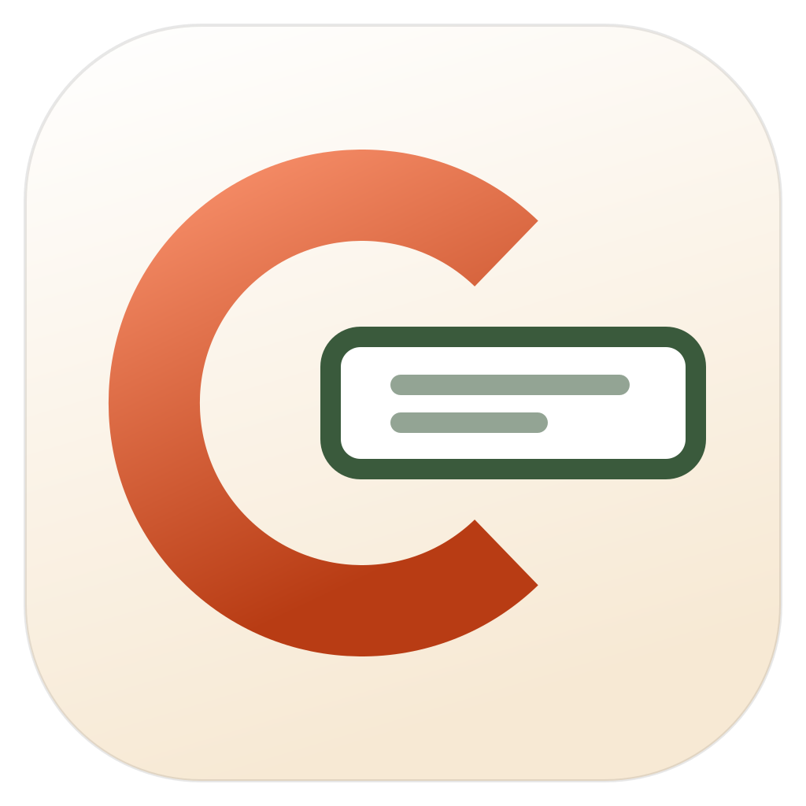

<p align="center">
  
</p>

<h1 align="center">Cosecre</h1>

<p align="center">
  Photograph an invoice or a receipt, and it comes back as structured fields in a shared
  spreadsheet — checked by a person before it counts.
</p>

## What this is

Three pieces, one of which does all the work:

| | | |
|---|---|---|
| [**hub/**](hub) | `cosecre-hub` | The server. Accounts, sessions, the database, uploaded files, and a provider-agnostic LLM gateway. Every other app is a client of it. |
| [**frontend/**](frontend) | `@cosecre/web` | The web app. Vue 3 + Vite, installable as a PWA — which is what makes phone camera capture work. |
| [**desktop/**](desktop) | `cosecre-desktop` | Windows, macOS and Linux. Renders the *same* Vue app, with its own hub picker and auto-updates. |

```
┌──────────────┐   ┌──────────────┐   ┌───────────────┐
│  web (Vue)   │   │   desktop    │   │  any new app  │
└──────┬───────┘   └──────┬───────┘   └───────┬───────┘
       └──────────────────┼───────────────────┘
                   HTTPS + bearer tokens
                          ▼
                  ┌───────────────┐        ┌──────────────┐
                  │  cosecre-hub  │───────▶│ model + LLM  │
                  └───────┬───────┘        └──────────────┘
                          │
              SQLite/Postgres · Google Sheets · Drive
```

**The hub is the only thing that holds a secret.** Model API keys, the Google
service account, the database — all server-side. A desktop binary or a browser
bundle can be handed to anyone without leaking anything, which is the reason the
gateway exists rather than each client calling OpenAI itself.

## Downloads

Installers for every release are on the
[releases page](https://github.com/aitirga/cosecre/releases). They are unsigned,
so:

- **macOS** — Gatekeeper will refuse a downloaded DMG until the quarantine flag
  is cleared:
  ```bash
  xattr -dr com.apple.quarantine /Applications/Cosecre.app
  ```
- **Windows** — SmartScreen shows a warning; choose *More info → Run anyway*.

## Running the whole thing locally

### 1. The hub

```bash
cd hub && uv sync
```

```bash
cp .env.example .env
```

Set a real `COSECRE_SECRET_KEY`, an `COSECRE_OPENAI_API_KEY`, and the two
bootstrap-admin variables. Then:

```bash
uv run cosecre-hub
```

It serves `/api/v1` on port 8000, with interactive docs at
[`/docs`](http://127.0.0.1:8000/docs). Full configuration reference:
[hub/README.md](hub/README.md).

### 2. The clients

```bash
npm install
```

```bash
npm run dev:web
```

```bash
npm run dev:desktop
```

The web dev server proxies `/api` to the hub, so the browser stays on one origin
and there is no CORS to configure. The desktop app asks for the hub address on
first launch — `http://127.0.0.1:8000` for a local one.

### Deploying the web app

Build it with `npm run build:web` and serve `frontend/dist` however you like.
The simplest arrangement is one reverse proxy with the static files at `/` and
the hub at `/api` — the client then asks for `/api/v1` on its own origin, and
there is no CORS to configure in production either. If the two must live on
different origins, set `VITE_API_BASE_URL` at build time and add the app's
origin to `COSECRE_CORS_ORIGIN_REGEX`.

## Accounts

There is no signup form once the hub has an account, and no seed file with
passwords in it. Two ways in:

- **Bootstrap an admin** from the environment. Setting both variables creates the
  account, or resets its password, on the next start — which is also the way back
  after a lockout:
  ```bash
  COSECRE_BOOTSTRAP_ADMIN_EMAIL=you@example.com
  COSECRE_BOOTSTRAP_ADMIN_PASSWORD=something-long-and-unguessable
  ```
- **Register the first account** through the app. While the hub has zero users,
  the sign-in screen offers it, and the account it creates is the administrator.

From then on, that administrator adds everyone else in **Settings → Team**, which
also handles password resets and disabling accounts. Accounts are disabled rather
than deleted, so the uploads and jobs they own keep their owner.

> **Migrating from the old `backend/`?** Its `seed_users.json` held plaintext
> passwords and was committed. Treat every password in it as compromised, rotate
> them, and provision accounts the way above. The file is now gitignored.

## How extraction works

```
photo / PDF ──▶ hub stores it ──▶ LLM gateway (structured output)
                                        │
                            ┌───────────┴───────────┐
                            ▼                       ▼
                   Google Drive copy        Google Sheets row
                                                    │
                                     a person checks it ──▶ Validated
```

Every upload becomes a job the client polls, so progress survives a page reload
and a phone going to sleep. Nothing is marked validated by the model — the
spreadsheet row stays flagged until a human confirms it.

The spreadsheet, not the database, is the record people actually work in: reads
reconcile against it, edits made directly in Sheets win, and column order is
discovered from the header row rather than assumed.

## Updating the desktop app

The app updates itself from **GitHub Releases** — there is no server to run.
electron-builder uploads the installers plus a `latest.yml` / `latest-mac.yml`
manifest, and `electron-updater` inside the app reads that manifest. Checks run 8
seconds after launch and every 6 hours; **Settings → Updates** shows the running
version and has a *Check now* button.

Cutting a release is a tag push:

```bash
npm version 0.2.0 --workspace cosecre-desktop
```

```bash
git commit -am "release: desktop 0.2.0" && git tag v0.2.0 && git push --follow-tags
```

That fires [`.github/workflows/release.yml`](.github/workflows/release.yml), which
builds macOS, Windows and Linux in parallel, uploads all three to a **draft**
release, and then — only once every platform has finished — publishes it. That
ordering matters: a client never sees a release that is missing its own
installer, and if any platform fails the release simply stays a draft.

The tag must match the version in `desktop/package.json`. That version is what
the app compares against, so a mismatched tag produces a release nobody is ever
offered.

| Platform | Behaviour |
|---|---|
| Windows | **Full auto-update.** Downloads in the background, installs on next quit — or immediately via *Restart and install*. |
| Linux | **Full auto-update**, when running as an AppImage. |
| macOS | **Check and notify.** Reports the new version and opens the release page to download the DMG. |

macOS is the odd one out, and not by choice. Squirrel.Mac reads the running
bundle's designated code requirement before replacing it, so an app that is
unsigned — or only ad-hoc signed — **cannot** update itself in place; it fails
with an opaque signature error. Rather than pretend otherwise, the app asks
`codesign` what it is at startup and degrades to a download link, saying why.

Because that check happens at runtime, **enabling real macOS auto-update takes no
code change**:

1. Add a Developer ID certificate as the repository secrets
   `MAC_CERT_P12_BASE64` (the `.p12`, base64-encoded) and `MAC_CERT_PASSWORD`.
   The workflow already reads both.
2. Delete `identity: null` from [`desktop/electron-builder.yml`](desktop/electron-builder.yml).

## Building a new Cosecre app

The hub is not invoice-specific. A new app needs no server-side change:

1. `GET /api/v1/meta` — unauthenticated, so a client can validate a hub URL that
   someone just typed, before it holds any credentials. It reports which features
   are on and whether an account exists.
2. `POST /api/v1/auth/login` with a `client` field, so the session is
   identifiable in the user's device list.
3. `GET`/`PUT /api/v1/apps/<your-slug>/settings` — authenticated storage for your
   configuration, as one JSON bundle. Reads for any user, writes for admins.
4. `POST /api/v1/llm/complete`, `/llm/structured` or `/llm/extract` instead of
   shipping a model API key.

[hub/README.md](hub/README.md) has the full API table.

## Tests

```bash
cd hub && uv run pytest
```

```bash
npm run typecheck
```

The hub's suite runs against a fake model provider and a dict standing in for
Google Sheets, so it needs no credentials and makes no network calls.

## Design

One light theme: warm paper surfaces, a terracotta accent, olive and gold for
status. The tokens — and the measured contrast ratio behind every text colour —
are in [`frontend/src/style.css`](frontend/src/style.css). Shared primitives
(`.btn`, `.input`, `.card`, `.table`, `.badge`) live there too rather than in each
component, because a button that is 6px in one view and 8px in another is what
made the previous UI look improvised.

The interface uses a system font stack and no webfont. That is not only a
performance choice: the packaged desktop app may have no internet access on first
launch, and a UI whose type shifts once a font arrives is worse than one that
never waited.

The icon and the in-app mark share one source in [`brand/`](brand), regenerated
with:

```bash
npm run icons
```

## Layout

```
hub/                    # the server (Python, uv)
├── src/cosecre_hub/
│   ├── api/            # meta, auth, users, apps, llm, documents
│   ├── services/llm/   # provider contract + OpenAI implementation
│   └── services/       # Sheets/Drive sync, storage, extraction
└── tests/              # no credentials, no network

frontend/               # @cosecre/web — the UI both clients render
└── src/
    ├── api/client.ts   # runtime-configurable base URL + pluggable token store
    ├── app.ts          # createCosecreApp(), the shared entry point
    └── platform.ts     # what the surrounding shell can do

desktop/                # cosecre-desktop — Electron
brand/                  # icon source
backend/                # superseded by hub/ — see hub/README.md to migrate
```
